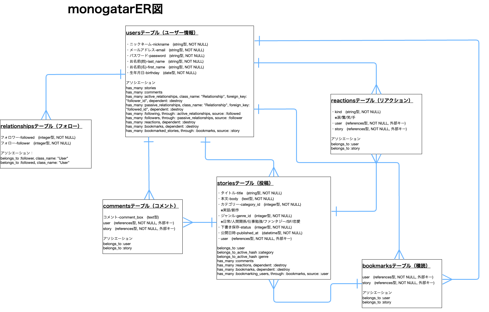
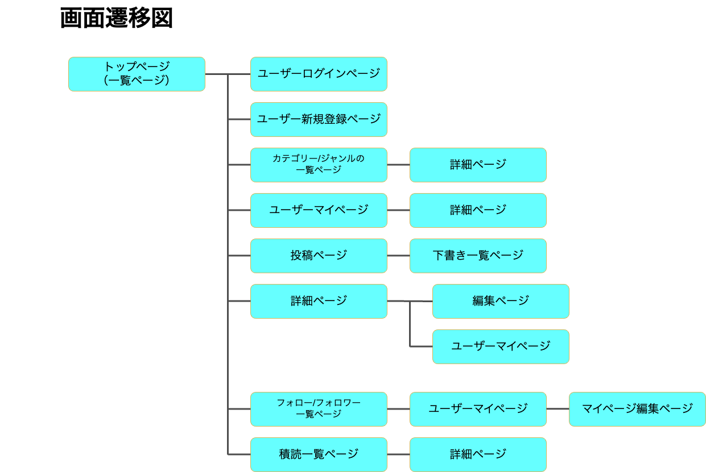

# アプリケーション名
---
者-モノ-語り　（読み：ものがたり）
 

# アプリケーション概要
---
物語を投稿する、読む　長文専門のプラットフォーム
 

# URL
---
https://mono-gatari.onrender.com
 

# テスト用アカウント
---
・Basic認証ID：kuraomirako
・Basic認証パスワード：7700
・メールアドレス：ac.test@example.com
・パスワード：test000
 

# 利用方法
---
1.トップページのヘッダーにある「新規登録ボタン」をクリックし、ユーザー登録を行う
2.ヘッダー右上にある「投稿する」ボタンをクリック
3.カテゴリー/ジャンルをプルダウンから選択し、タイトル/本文を文字数制限に沿って入力
4.投稿する場合は「投稿する」ボタンをクリック｜下書きにしたい場合は「下書き保存」ボタンをクリック
5.投稿した物語は、詳細ページから「編集」「削除」「下書き保存に戻すこと」が可能

- 未ログインでも物語を最後まで読むことができます。
- ただし、コメントやマイページの作成、その他の機能は利用できません。

 

# アプリケーションを作成した背景
---
投稿者・読者 それぞれににテーマがあります。

◀︎ 投稿者 ▶︎
「自分の経験談、小さい頃の記憶、知り合いに話すほどではない話、取り止めのない話」。でも『カタチとして残しておきたい』を叶える

◀︎ 読 者 ▶︎
『体験談を聞くのが好き、リアルに足を運べない、身近にいる人では聞ける話しが限られる』を解消する

端末の中とはいえ、落ち着ける場所、ふとした時に着たくなる場所を作りたいと思いました。

今は、パッとつぶやけるアプリやブログ、小説投稿アプリなど… 類似アプリはたくさんあると思います。
その中で『その 人物＝者 のお話しをメインとした』“長文専門”のアプリケーションを目指しました。

# 実装予定の機能
---
- 退会機能
- フッターの充実（お問い合わせ、よくある質問などを追加）
 

# データベース設計
---

 

# 開発環境
---
- フレームワーク：Ruby On Rails
- 言語：Ruby、JavaScript、HTML、CSS
- データベース：MySQL(開発環境)、PostgreSQL(本番環境)
- 開発ツール：VSCode、GitHub、Render
 

# ローカルでの動作方法
---
以下のコマンドを順に実行
% git clone https://github.com/kuraomirako/mono-gatari.git
% yarn
% rails db:create db:migrate
% bin/dev

# 工夫したポイント
---
- 長文専門のため、300文字未満は投稿できないように設定
- 落ち着ける空間作りのため、フォロー数/フォロワー数は、自分自身しか見れないように設定
 