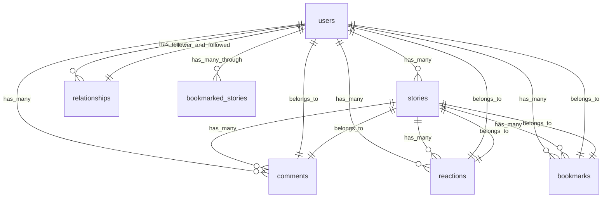

#### ◇　users テーブル
| Column             | Type   | Options     |
| ------------------ | ------ | ----------- |
| nickname           | string | null: false |
| email              | string | null: false |
| encrypted_password | string | null: false |
| last_name          | string | null: false |
| first_name         | string | null: false |
| birthday           | date   | null: false |

#### ⇆　association
has_many :stories
has_many :comments
has_many :active_relationships, class_name: "Relationship", foreign_key: "follower_id", dependent: :destroy
has_many :passive_relationships, class_name: "Relationship", foreign_key: "followed_id", dependent: :destroy
has_many :following, through: :active_relationships, source: :followed
has_many :followers, through: :passive_relationships, source: :follower
has_many :reactions, dependent: :destroy
has_many :bookmarks, dependent: :destroy
has_many :bookmarked_stories, through: :bookmarks, source: :story

......................................................................................

#### ◇　stories テーブル
| Column       | Type       | Options                        |
| ------------ | ---------- | ------------------------------ |
| title        | string     | null: false                    |
| body         | text       | null: false                    |
| category_id  | integer    | null: false                    |
| genre_id     | integer    | null: false                    |
| status       | integer    | null: false                    |
| published_at | datetime   | null: false                    |
| user         | references | null: false, foreign_key: true |

#### ⇆　association
belongs_to :user
belongs_to_active_hash :category
belongs_to_active_hash :genre
has_many :comments
has_many :reactions, dependent: :destroy
has_many :bookmarks, dependent: :destroy
has_many :bookmarking_users, through: :bookmarks, source: :user

......................................................................................

#### ◇　comments テーブル
| Column      | Type       | Options                        |
| ----------- | ---------- | ------------------------------ |
| comment_box | text       | null: false                    |
| user        | references | null: false, foreign_key: true |
| story       | references | null: false, foreign_key: true |

#### ⇆　association
belongs_to :user
belongs_to :story

......................................................................................

#### ◇　relationships テーブル
| Column      | Type    | Options     |
| ----------- | ------- | ----------- |
| follower_id | integer | null: false |
| followed_id | integer | null: false |

#### ⇆　association
belongs_to :follower, class_name: "User"
belongs_to :followed, class_name: "User"

......................................................................................

#### ◇　reactions テーブル
| Column | Type       | Options                        |
| ------ | ---------- | ------------------------------ |
| user   | references | null: false, foreign_key: true |
| story  | references | null: false, foreign_key: true |
| kind   | string     | null: false                    |

#### ⇆　association
belongs_to :user
belongs_to :story

......................................................................................

#### ◇　bookmarks テーブル
| Column | Type       | Options                        |
| ------ | ---------- | ------------------------------ |
| user   | references | null: false, foreign_key: true |
| story  | references | null: false, foreign_key: true |

#### ⇆　association
belongs_to :user
belongs_to :story

......................................................................................

......................................................................................
